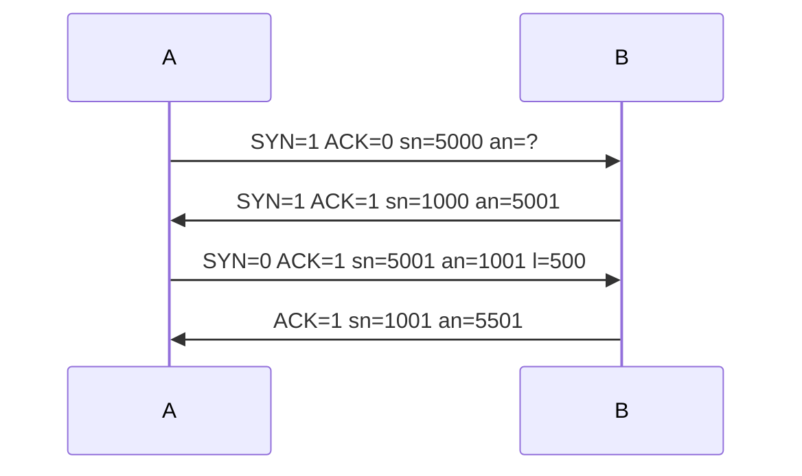

# Appunti
Repository per organizzare i miei appunti

## Attenzione!

nessun appunto è ancora conenuto quì 

| ciao               | prova di tabella           |
| ------------------ | -------------------------- |
| cosi vediamo anche | come funzionano le tabelle |
| moolto bene        | pare                       |

sto solo provando come usare il markdown per scrivere testo formattato ***facilmente***

  

### Mermaid
usando meremaid è possibile creare dei diagrammi di vario tipo, tra cui questi comodi diagrammi di sequenze, per visualizzarlo potresti dover usare dei plugin

Diagramma "Three way Handshake"

