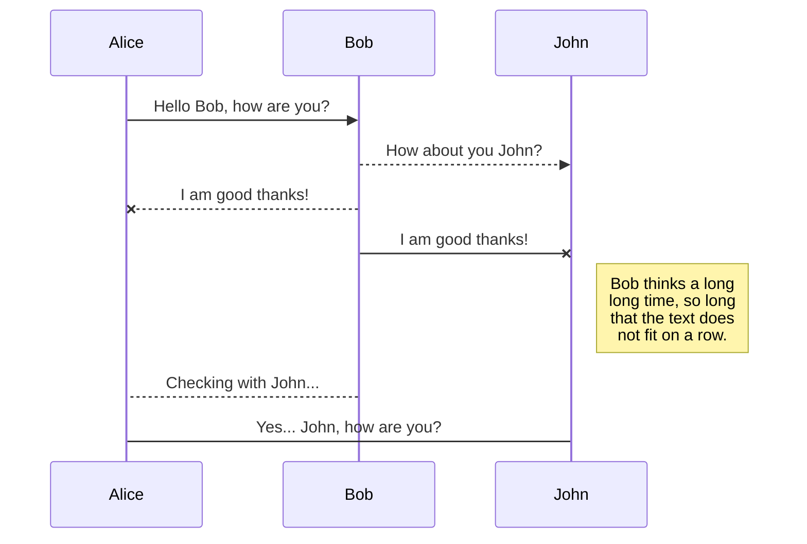

# Appunti
Repository per organizzare i miei appunti

## Attenzione!

nessun appunto è ancora conenuto quì 

| ciao               | prova di tabella           |
| ------------------ | -------------------------- |
| cosi vediamo anche | come funzionano le tabelle |
| moolto bene        | pare                       |

sto solo provando come usare il markdown per scrivere testo formattato ***facilmente***

provo una cosa 

[Mermaid](https://mermaidjs.github.io/)

