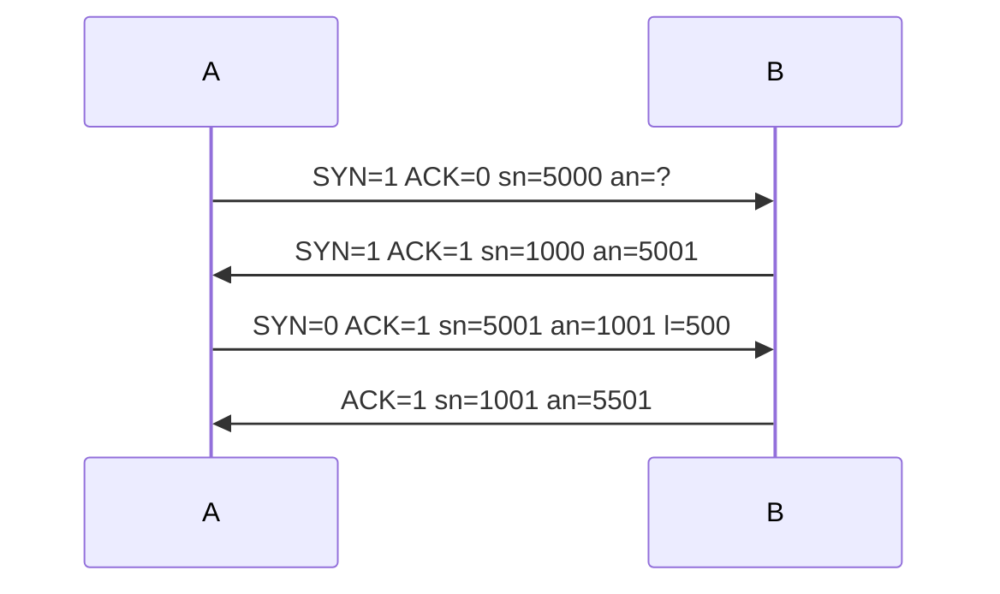

# Appunti

Repository per organizzare i miei appunti

## Attenzione!

``` 

Gli appunti verranno caricati man mano col proseguire delle lezioni
```

Sto solo provando come usare il markdown per scrivere testo formattato ***facilmente*** e tenere il testo comodamente su GitHub.

| ciao               | prova di tabella           |
| ------------------ | -------------------------- |
| cosi vediamo anche | come funzionano le tabelle |
| moolto bene        | pare                       |

---
---

## setup consigliato

```

Per la corretta visualizzazione si consiglia  l'utilizzo di VS Code insieme ai 
plugin "Meremaid Preview" e "Markdown All in One" che permettereanno di 
visualizzare il testo markdown, il risultato formattato, e gli eventuali 
diagrammi di flusso (vedi prossimo punto) realizzati con Mermaid (si, come 
sirena in inglese)

```

---
---

## Mermaid

```

Usando Mermaid è possibile creare dei diagrammi di vario tipo, tra cui questi 
comodi diagrammi di sequenze, per visualizzarlo potresti dover usare dei plugin,

E` possibile leggere i diagrammi anche senza plugin, la sintassi è abastanza 
chiara, solo che sono più chiari visualizzati correttamente
```

Diagramma "Three way Handshake"

